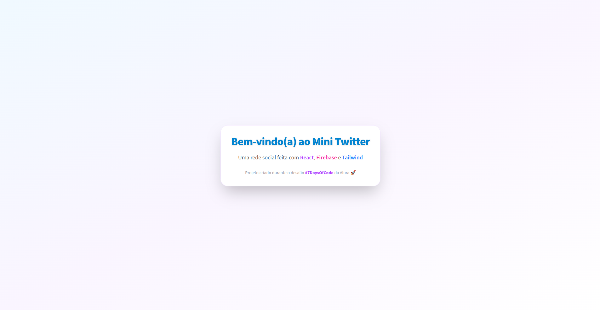
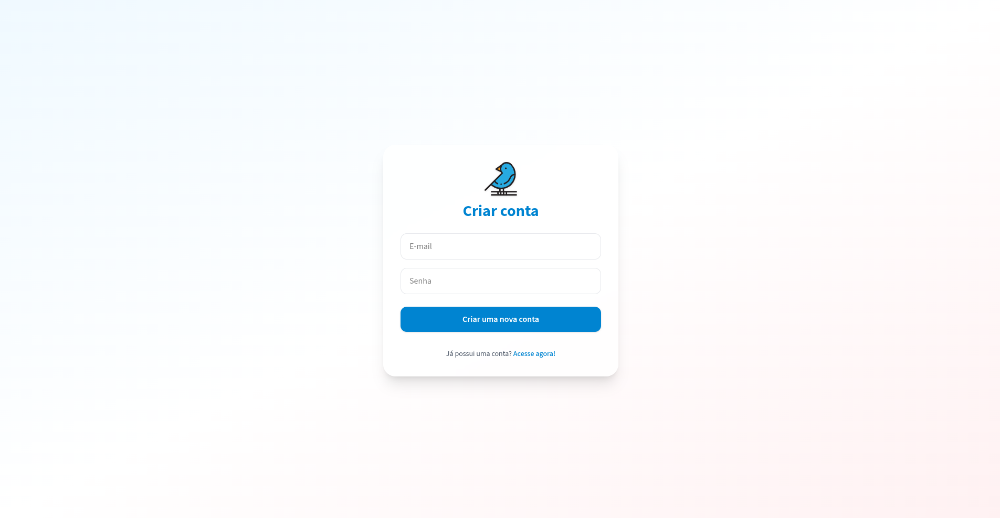
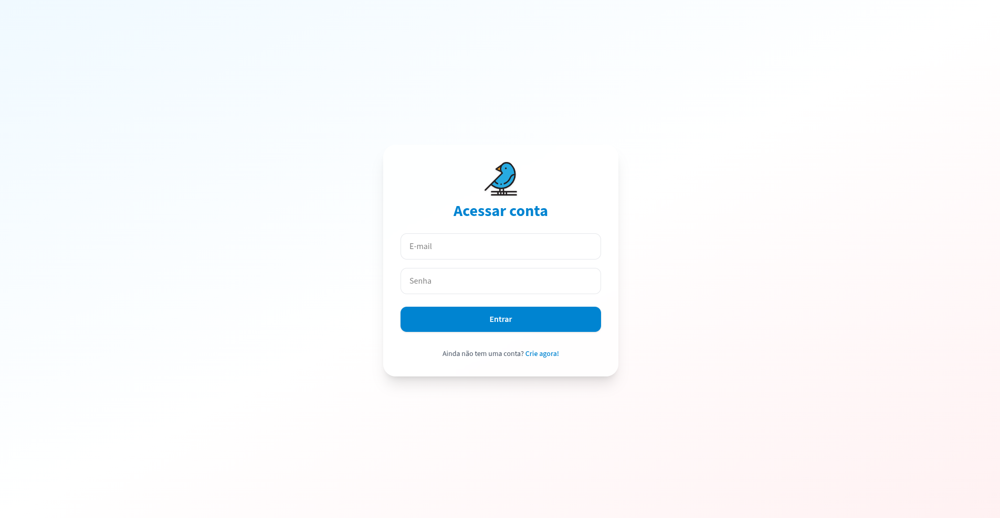
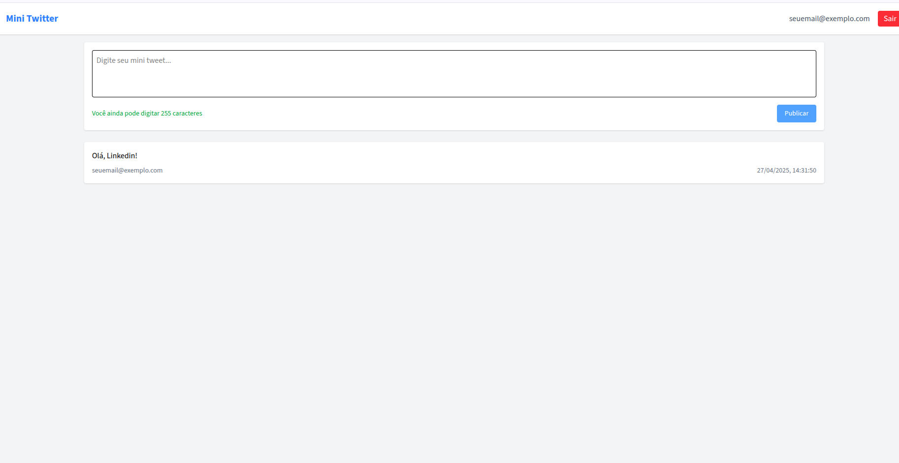
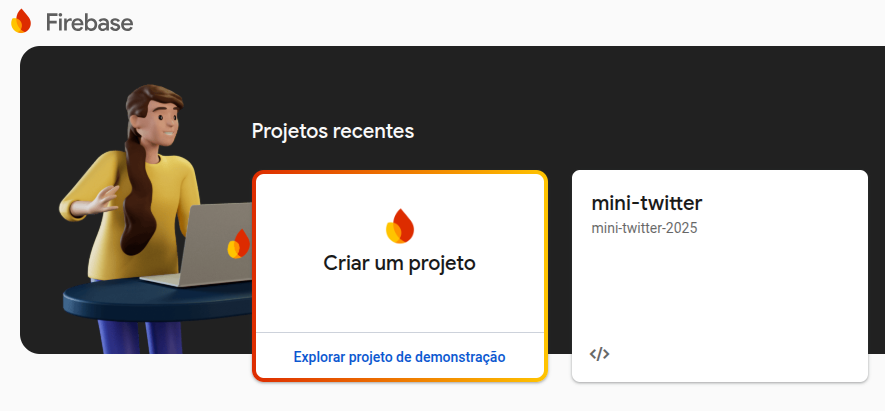
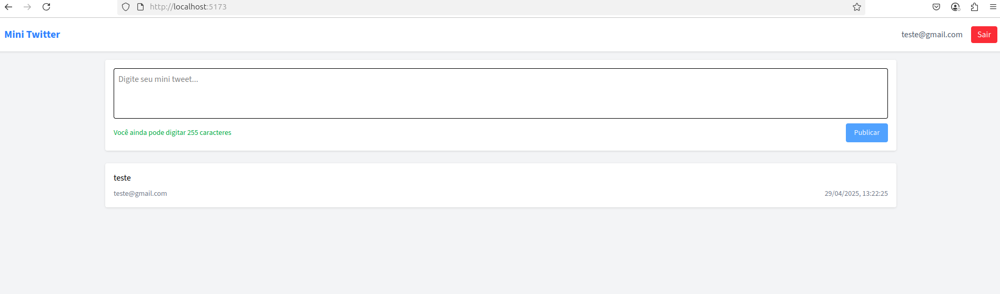

# Mini Twitter — #7DaysOfCode | React + Firebase

Este repositório documenta o desenvolvimento de uma aplicação inspirada no Twitter (X), feita como parte do desafio **#7DaysOfCode** da Alura, com orientação de Matheus Castiglioni.

O projeto está sendo construído com foco em boas práticas, utilizando **React**, **Vite**, **TailwindCSS** e **Firebase**, com o objetivo de evoluir habilidades em front-end moderno e integração com serviços em tempo real.

## 🚀 Progresso

📆 **Dia atual**: Dia 6 de 7  
📊 **Status**: Concluído

## 📌 Metas por Dia

### 🧩 Dia 1 — Estrutura Inicial
Criada a fundação do projeto: estrutura, design base e configurações iniciais.

### 🧱 Dia 2 — Página de Cadastro
Desenvolvida a página de cadastro com layout responsivo e formulários usando React Hook Form.

### 🧑‍💻 Dia 3 — Página de Autenticação (Login)
Criada a página de login utilizando componentes reutilizáveis e boas práticas de autenticação.

### 🏠 Dia 4 — Página Principal (Home)
Página principal da aplicação onde usuários autenticados podem publicar e visualizar mensagens em tempo real.

### 🔒 Dia 5 — Autenticação
Integração completa com o Firebase Authentication. 

### 🧭 Dia 6 — Comportamento de Login e Navegação
Adicionados os comportamentos na página de autenticação: login funcional com Firebase, rotas protegidas redirecionando corretamente, exibição do e-mail do usuário logado no cabeçalho e implementação da funcionalidade de logout.

## 🧰 Tecnologias utilizadas

- React
- Vite
- Tailwind CSS
- React Router
- React Hook Form
- classnames
- Firebase Authentication
- Firebase Firestore

---

👩‍💻 Projeto desenvolvido por [Ana Laura Coan](https://www.linkedin.com/in/analauracoan/) como parte do desafio **#7DaysOfCode** da Alura.
